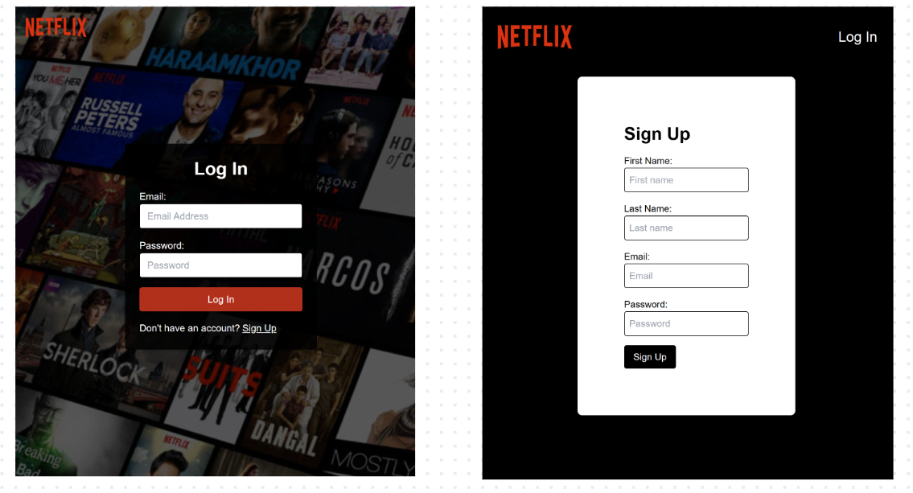
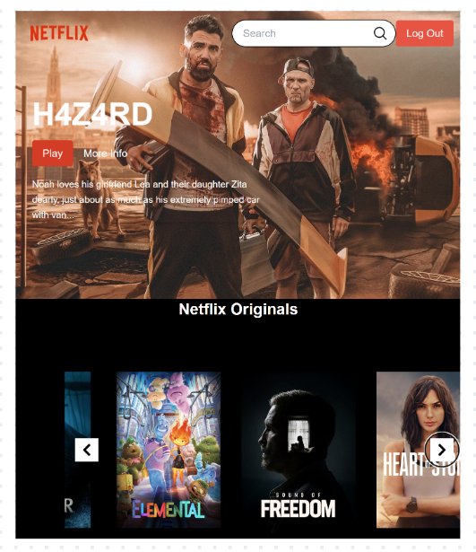

## Netflix Project
The Netflix Clone Project is a full-stack web application that allows users to browse a collection of popular streaming movies This project includes both frontend and backend components and offers features such as viewing details about specific titles and watching trailers.


   ## Home

   ## Log In and Sign Up


  ## Netflix
  

  ## Live Demo
- [NetflixClone](https://netflix-project.onrender.com/)
# Netflix Clone Frontend

This is the frontend part of a Netflix clone application built with React. It allows users to sign up, log in. Users can also watch trailer and view details about specific titles.


## Getting Started

To get started with this Netflix clone frontend, follow the steps below:

1. Clone the repository to your local machine:

   ```bash
   git clone https://github.com/kaliamdie/Netflix-CloneProject.git
2. open this 
   ```bash 
    cd netflix-clone-frontend
on your terminal.


3. Install the necessary dependencies:


```npm install```

4. Start the development server:
   
   ``` npm start```
## Fetaures
- User Authentication: Users can sign up and log in to the application.
- Netflix page: The netflix page displays a selection of movie.
- Content Details: Users can click on a more info button to view more details and when user click the poster it also display the trailer.
- Responsive Design: The application is designed to work on both desktop and mobile devices.

# usage
- Sign Up: Click on the "Sign Up" button and fill in your details to create an account.
- Log In: Click on the "Log In" button and provide your email and password to access your account.
- Netflix Homepage: Browse through the available content on the homepage.
- Content Details: Click on a button to view more information and watch the trailer.
- Log Out: If logged in, you can log out by clicking the "Log Out" button.
## Techonolgies used
- React
- Tailwind
## API
-[ TMDB API](https://developer.themoviedb.org/docs)
# Netflix clone backend
The backend part of the Netflix Clone Project handles user authentication and interaction with external APIs for data retrieval.

## Overview

User Authentication is a component of the application that handles user registration, login, and token-based authentication. This component ensures that only authorized users can access protected resources within your application.

## Technologies Used

- Node.js
- Express.js
- MongoDB 
- bcrypt (for password hashing)
- JSON Web Tokens (JWT) for authentication
## Resources
- [stackoverflow](https://stackoverflow.com/)
- [GeeksforGeeks](https://www.geeksforgeeks.org/basic-authentication-in-node-js-using-http-header/)
- [freecodecamp](https://www.freecodecamp.org/news/tag/authentication/)
- [medium](https://medium.com/@ballerbytes/netflix-fullstack-clone-2023-8a35e23d5db0)

## Features

- User Registration: Users can create new accounts by providing their first name, last name, email, and password. Passwords are securely hashed before storage.
- User Login: Registered users can log in using their email and password. Upon successful login, they receive a JWT token.
## Setup and Usage

To set up and use the User Authentication component, follow these steps:

1. Clone this repository to your local machine.
  ```cd Netflix-CloneProject```
  
2.  ``` cd backend```
 
 

3. Install the required dependencies using the following command:

   ```npm install```
   
4.  start the server 
  

   ```nodemon server```
   
